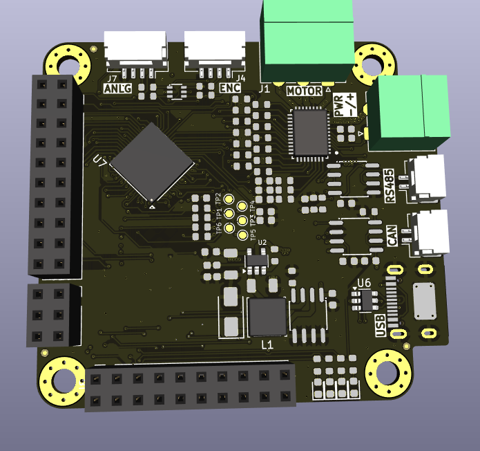
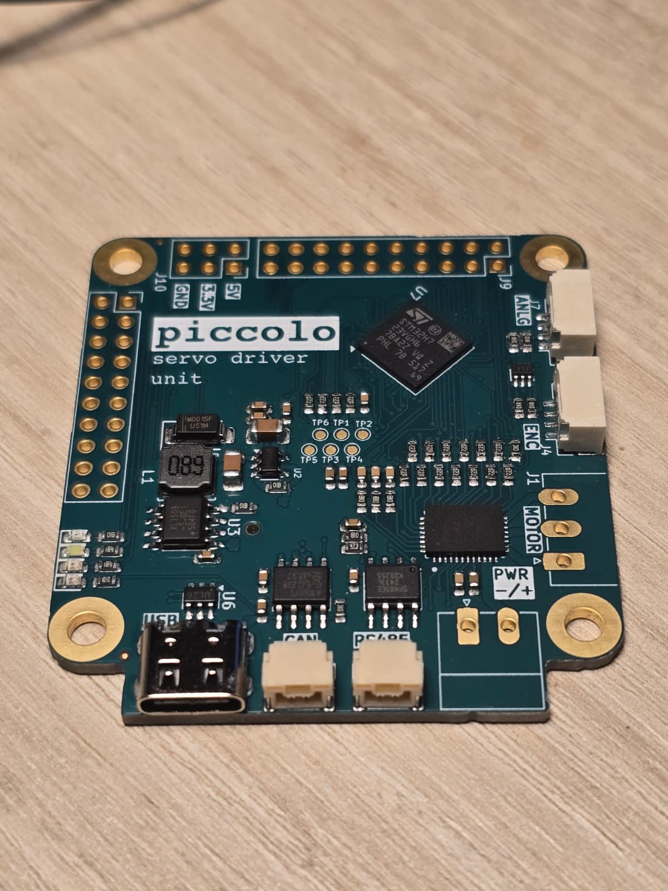

# PiccoloMotorDriver

Yet another open source servo motor driver designed using Kicad, based on STM32H723 MCU and DRV8316 integrated 3-phase motor driver.

Firmware can be found here (under development): https://github.com/AytuncPOLAT/PiccoloMotorDriverFw

All the subsystems have been tested

| Subsystem     | Test Status           |
| ---------     | ------------------    |
| FDCAN         | :heavy_check_mark:    |
| RS485         | :heavy_check_mark:    |
| USB           | :heavy_check_mark:    |
| Debug UART    | :clock9:              |
| SWD           | :heavy_check_mark:    |
| Ext. Encoder  | :heavy_check_mark:    |
| Ext. Analog   | :heavy_check_mark:    |
| LEDs          | :heavy_check_mark:    |
| J9 GPIOs      | :clock9:              |
| DRV8316       | :heavy_check_mark:    |

